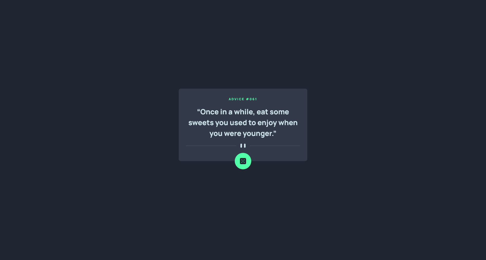

# Frontend Mentor - Advice generator app solution

This is a solution to the [Advice generator app challenge on Frontend Mentor](https://www.frontendmentor.io/challenges/advice-generator-app-QdUG-13db). Frontend Mentor challenges help you improve your coding skills by building realistic projects.

## Table of contents

- [Overview](#overview)
  - [The challenge](#the-challenge)
  - [Screenshot](#screenshot)
  - [Links](#links)
- [My process](#my-process)
  - [Built with](#built-with)
  - [What I learned](#what-i-learned)
  - [Useful resources](#useful-resources)
- [Author](#author)

## Overview

### The challenge

Users should be able to:

- View the optimal layout for the app depending on their device's screen size
- See hover states for all interactive elements on the page
- Generate a new piece of advice by clicking the dice icon

### Screenshot



### Links

- Solution URL: [Advice Generator App Solution](https://your-solution-url.com)
- Live Site URL: [Advice Generator App Live](https://your-live-site-url.com)

## My process

### Built with

- Semantic HTML5 markup
- CSS custom properties
- [Tailwind CSS](https://tailwindcss.com/) - CSS Framework
- Mobile-first workflow

### What I learned

In this project I learned how to properly use propagation and recovery in asynchronous operation.

```js
//propagation layer
async function fetchAdvice() {
    try {
        //... do something first layer
    }
    catch (error) {
        console.error('[L1] An Error occurred while fetching advice:', error.message);
        throw error; // propagation
    }
}

// recovery layer
async function processAdvice() {
    try {
        //... do something second layer
    }
    catch (error) {
        console.error('[L2] An Error occurred while processing advice:', error.message);
        const defaultAdvice = 'It always seems impossible until it is done.';
        return { id: "000", advice: defaultAdvice }; // recovery
    }
}

// final layer
async function displayAdvice() {
    document.querySelector('button[onclick="displayAdvice()"]').disabled = true;
    showLoader();
    try {
        //... do something
    }
    catch (error) {
        console.error('[L3] An Error occurred while displaying advice:', error.message);
    }
    finally {
        document.querySelector('button[onclick="displayAdvice()"]').disabled = false;
        hideLoader();
    }
}
```

### Useful resources

- [Tailwind CSS Documentation](https://tailwindcss.com/docs/installation/using-vite) - This helped me for implementing tailwind css in the website. It's really understand and I will use it going forward.
- [MDN Web Docs](https://developer.mozilla.org/en-US/docs/Web/CSS) - This helped me for implementing vanila CSS in the website. I really liked how they put a description and example to each property of CSS.

## Author

- Github - [Heherson Aledia](https://github.com/hhrsnm)
- Frontend Mentor - [@hhrsnm](https://www.frontendmentor.io/profile/hhrsnm)
- LinkedIn - [Heherson Aledia](www.linkedin.com/in/heherson-aledia-ba7b60310)

